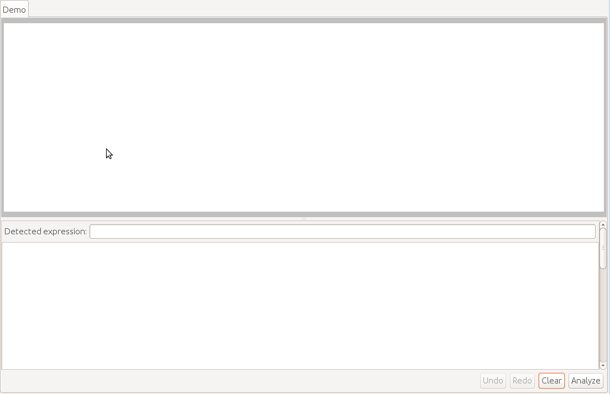
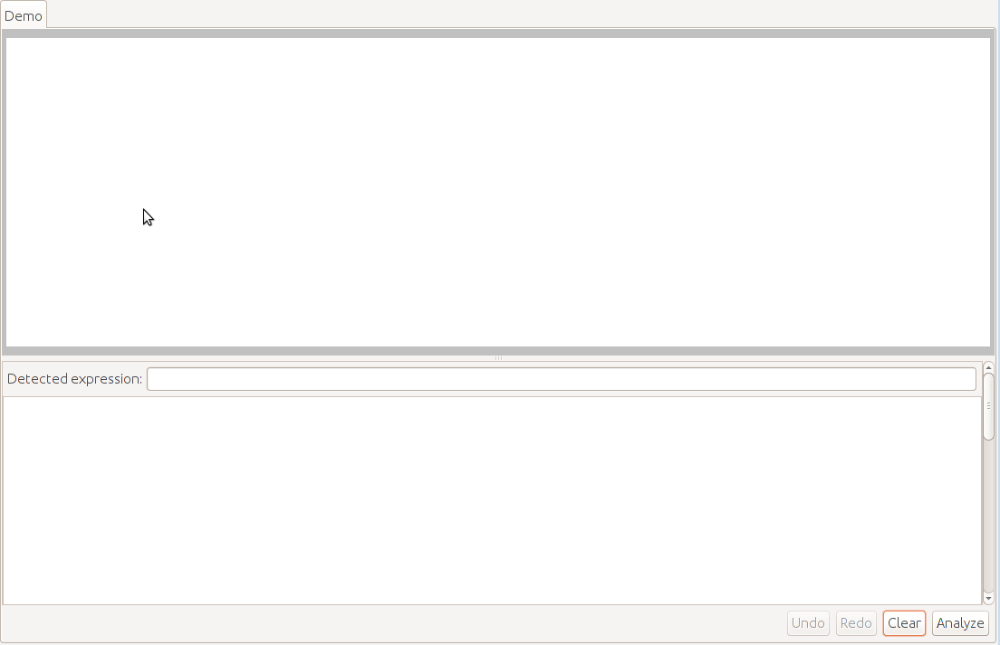

# BooleanFunctionGestureRecognition
Handwritten boolean function recognition and evaluation

This project implements a system for recognizing and evaluating hand written boolean functions. 
A user writes a boolean functions and the system outputs the functions truth table. 

The following tokens are supported: 
* **Function** F{A|B|C|D|0|1}\*  
* **Variable** {A|B|C|D}
* **Constant** {0|1}
* **Negation** {-, a line above the written expression}
* **Brackets** {(|)} 
* **Or operator** +
* **And operator** \*
* **Assigment operator** =

Example 1: Writing an expression

Example 2: Defining a function and using it in an expression

## How the system works
This system works in the following way: 
1. It groups individual gestures into symbols
2. It recognizes the written symbols
3. It performs special parsing

The first step uses an ansamble of neural networks trained to perform gesture grouping. 

The second step uses an ansamble of neural networks trained for symbol recognition. 

The third step is done with a custom implemented deterministic spatial parser. 

**NOTE**: I could not upload everything needed to get the system up and running after a git clone because of memory limitations. 
If you have any questions feel free to contact me on: petar.afric@fer.hr

